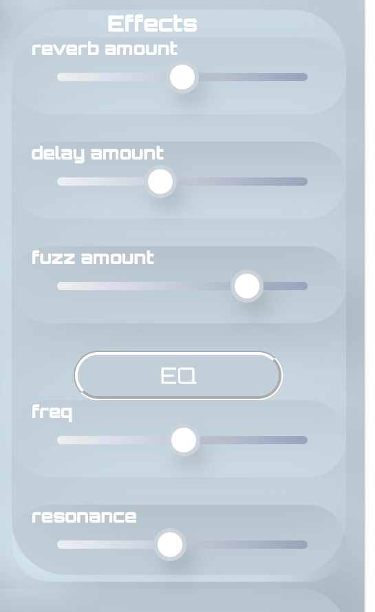
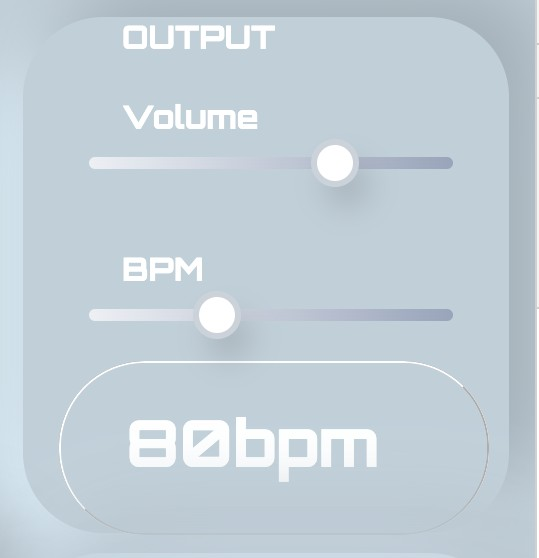

# QUICK GUIDE TO TONEDRUM

## What is ToneDrum?

ToneDrum is a very simple drum machine that can be used in the browser on any device and desktop. It's built using the p5.js Sound Library.

## Main Features

ToneDrum consists of 6 different drum sounds. 
- hi-hat
- clap
- kick drum
- snare
- crash 
- tom-tom 

## Sample Manipulation
Each samples sound can be manipulated using the individual controls and effects. These controls utilise the pitch and volume of each sample, while the effects include reverb, delay and distortion (the fuzz button) effects. 

## Effects
Furthermore, there is also an overall **Effects** panel. You can control the overall amount of reverb, delay and *fuzz* here, as well as manipulate the frequency.
<!--  -->

## Output
On the **Output** panel you will find an overall volume slider as well as a slider labelled as BPM. The latter will control the speed of the playback, will the volume will control the overall output. 
<!--  -->

## Sequencer
In the upper portion of the drum machine is a black and white grid section that, when the play button is pressed, can be seen to be iterated through by beat through a 16 note sequence. Each row denotes one of the drum sounds. By clicking inside the grid sections you can control if a particular sound is played or not. If you can see a white circle in the grid, the sample will be played. Otherwise it will not. By manipulating this interface you can make your own drum patterns. 

## Starting The Machine

It's super easy. Just press play!

As the loop playes back have a play with the sequencer, add some effects by pressing the buttons and changing the sliders. 

Have fun!!
